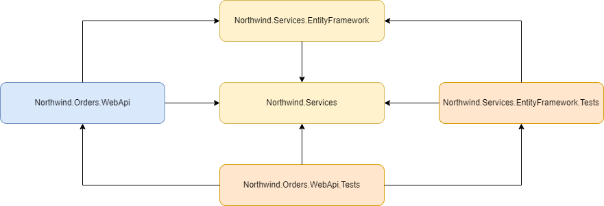
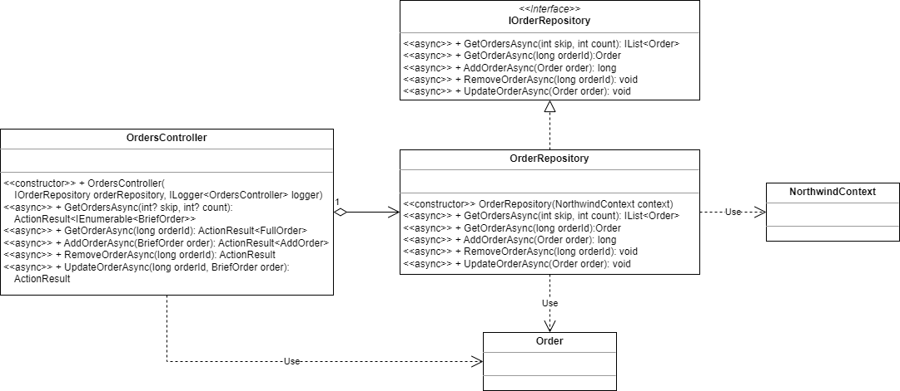
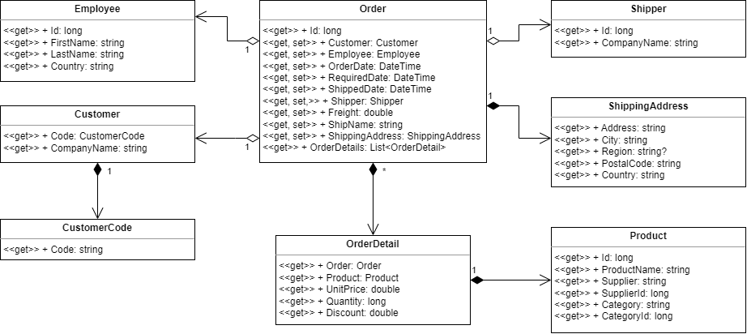
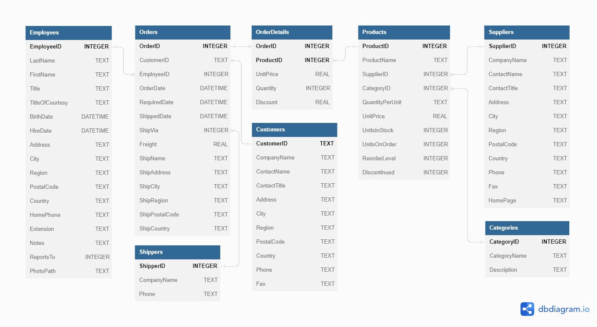

# Northwind Order Repository (Web API)

An advanced-level task to practice creating the Web API application that accesses a relational database as a data source.

To successfully complete the task, you must have the following skills:
* You should be familiar with structured and object-oriented programming in C#.
* You should be familiar with .NET's string parsing and data formatting capabilities.
* You should be familiar with the [task asynchronous programming model (TAP)](https://learn.microsoft.com/en-us/dotnet/csharp/asynchronous-programming/task-asynchronous-programming-model).
* You should be familiar with the [Entity Framework](https://learn.microsoft.com/en-us/aspnet/entity-framework) object-relational mapper.
* You should be familiar with the [Repository design pattern](https://martinfowler.com/eaaCatalog/repository.html).
* You should know how to build [controller-based Web API applications](https://learn.microsoft.com/en-us/aspnet/core/web-api/?view=aspnetcore-7.0) using ASP.NET Core.

Estimated time to complete the task: 6 hours.

The task requires [.NET 6 SDK](https://dotnet.microsoft.com/en-us/download/dotnet/6.0) to be installed.

## Task Description

In this task, you have to develop a Web API application using ASP.NET Core and the Entity Framework.

The application consists of a few components that you have to implement:
1. Design and implement [entity types](https://learn.microsoft.com/en-us/ef/core/modeling/entity-types) and map them to the underlying database.
1. Implement the order repository that searches and manages orders. The order repository object should access a data source using the Entity Framework.
1. Implement action methods in the ASP.NET controller class to handle the incoming HTTP requests.

The application uses the [SQLite in-memory database](https://www.sqlite.org/inmemorydb.html) as a data source.

### Project Structure

The solution for this task consists of five projects:
* The [Northwind.Orders.WebApi](Northwind.Orders.WebApi) project is a Web API application that is built using the ASP.NET Core framework.
* The repository interface and shared data classes are located in the [Northwind.Services](./Northwind.Services) project.
* The repository implementation is located in the [Northwind.Services.EntityFramework](Northwind.Services.EntityFramework) project.
* The [Northwind.Services.EntityFramework.Tests](Northwind.Services.EntityFramework.Tests) project contains unit tests for the repository implementation.
* The [Northwind.Orders.WebApi.Tests](Northwind.Orders.WebApi.Tests) project contains unit tests for the Web API controller class.

Diagram 1. Project Dependency Diagram.

### Entity Types.

To enable the order repository to work with a database, you have to:

1. Design and implement the necessary entity types in the [Entities](Northwind.Services.EntityFramework/Entities) folder of the `Northwind.Services.EntityFramework` project.
1. Configure the [NorthwindContext](Northwind.Services.EntityFramework/Entities/NorthwindContext.cs#L5) by including a DbSet for each entity type.
1. Map entity types to the underlying database. You may use the data annotation approach or the Fluent API.

### The OrderRepository Class

The [OrderRepository](Northwind.Services.EntityFramework/Repositories/OrderRepository.cs#L7) class provides methods for searching and returning order data, as well as methods for managing orders.
* [GetOrdersAsync](Northwind.Services/Repositories/IOrderRepository.cs#L15) returns a list of orders from a repository. The `skip` method parameter specifies the number of orders to skip before adding an order to the result list. The `count` method parameter specified the number of orders to return. The result list should be sorted by order ID, from smallest to largest.
* [GetOrderAsync](Northwind.Services/Repositories/IOrderRepository.cs#L22) returns an order with the specified identifier.
* [AddOrderAsync](Northwind.Services/Repositories/IOrderRepository.cs#L30) adds a new order to the repository as well as order details.
* [RemoveOrderAsync](Northwind.Services/Repositories/IOrderRepository.cs#L37) removes an order with the specified identifier as well as the order details.
* [UpdateOrderAsync](Northwind.Services/Repositories/IOrderRepository.cs#L44) updates order data as well as order details.

Diagram 2. OrderRepository Class Diagram.

An order is represented by the [Order](Northwind.Services/Repositories/Order.cs) class. There are a few related classes that represent order data and order details.

Diagram 3. Order Class Diagram.

The implementation of the `OrderRepository` class must meet the following requirements:
* The repository class must implement the [IOrderRepository](Northwind.Services/Repositories/IOrderRepository.cs) interface.
* Methods declared in the `IOrderRepository` interface must be implemented in the repository class as asynchronous methods that conform to the task asynchronous programming model. Use the asynchronous methods when searching or updating an order in the data source.
* The repository class must use the [NorthwindContext](Northwind.Services.EntityFramework/Entities/NorthwindContext.cs) object to access the database entities in the database.
* The repository class must implement *Constructor Injection* form of the [Dependency Injection](https://en.wikipedia.org/wiki/Dependency_injection) design pattern.
* The repository class must have one public constructor with one parameter to initialize a repository object with the `NorthwindContext` object (see Diagram 2).
* The `GetOrderAsync`, `RemoveOrderAsync` and `UpdateOrderAsync` methods must throw the [OrderNotFoundException](Northwind.Services/Repositories/OrderNotFoundException.cs) if a repository has no order with the specified identifier.
* The `AddOrderAsync` method must throw the [RepositoryException](Northwind.Services/Repositories/RepositoryException.cs) if a database operation returns an error.
* The `GetOrdersAsync` method must throw the [ArgumentOutOfRangeException](https://learn.microsoft.com/en-us/dotnet/api/system.argumentoutofrangeexception) if a method argument has incorrect value.

### The OrdersController Class

To allow a Web API application to handle incoming HTTP requests, you have to implement the [OrdersController](Northwind.Orders.WebApi/Controllers/OrdersController.cs#9) class as an ASP.NET WebAPI controller with the required action methods:

| Method Name      | HTTP Verb | URI                                  | HTTP Status Code |
|------------------|-----------|--------------------------------------|------------------|
| GetOrderAsync    | GET       | /api/orders/:orderId                 | OK               |
| GetOrdersAsync   | GET       | /api/orders?skip=:skip&count=:count  | OK               |
| AddOrderAsync    | POST      | /api/orders                          | OK               |
| RemoveOrderAsync | DELETE    | /api/orders/:orderId                 | No Content       |
| UpdateOrderAsync | PUT       | /api/orders/:orderId                 | No Content       |

The implementation of the action methods must meet the following requirements:
* The `OrdersController` class and its action methods should have all the necessary ASP.NET Core attributes.
* The repository class must implement *Constructor Injection* form of the [Dependency Injection](https://en.wikipedia.org/wiki/Dependency_injection) design pattern.
* The repository class must have one public constructor with two parameters to initialize a controller with the `IOrderRepository` and [ILogger<TCategoryName>](https://learn.microsoft.com/en-us/aspnet/core/fundamentals/logging) dependencies.
* The `skip` and `count` parameters of the `GetOrdersAsync` action method are optional. The default value for the `skip` parameter is `0`. The default parameter for the `count` parameter is `10`.
* The `GetOrderAsync`, `RemoveOrderAsync` and `UpdateOrderAsync` action methods must return the "Not Found" status code if a repository has no order with the specified identifier.
* All action methods must return the "Internal Server Error" status code if a repository method throws an unhandled exception.
* All action methods must write error and trace log messages.

### Northwind Database

The application and unit tests are configured to use the SQLite in-memory database as a data source. The database schema is shown on the Diagram 4.

Diagram 4. Northwind Database Schema.

### General Requirements

* The changes that are required to complete this task should be made in the files from the list below:

| Project                            | File                                                                                                  |
|------------------------------------|-------------------------------------------------------------------------------------------------------|
| Northwind.Orders.WebApi            | [Controllers/OrdersController.cs](Northwind.Orders.WebApi/Controllers/OrdersController.cs)            |
| Northwind.Services.EntityFramework | [Entities/Category.cs](Northwind.Services.EntityFramework/Entities/Category.cs)                       |
| Northwind.Services.EntityFramework | [Entities/Employee.cs](Northwind.Services.EntityFramework/Entities/Employee.cs)                       |
| Northwind.Services.EntityFramework | [Entities/NorthwindContext.cs](Northwind.Services.EntityFramework/Entities/NorthwindContext.cs)       |
| Northwind.Services.EntityFramework | [Entities/Order.cs](Northwind.Services.EntityFramework/Entities/Order.cs)                             |
| Northwind.Services.EntityFramework | [Entities/OrderDetail.cs](Northwind.Services.EntityFramework/Entities/OrderDetail.cs)                 |
| Northwind.Services.EntityFramework | [Entities/Product.cs](Northwind.Services.EntityFramework/Entities/Product.cs)                         |
| Northwind.Services.EntityFramework | [Entities/Shipper.cs](Northwind.Services.EntityFramework/Entities/Shipper.cs)                         |
| Northwind.Services.EntityFramework | [Entities/Supplier.cs](Northwind.Services.EntityFramework/Entities/Supplier.cs)                       |
| Northwind.Services.EntityFramework | [Repositories/OrderRepository.cs](Northwind.Services.EntityFramework/Repositories/OrderRepository.cs) |

* Do not install additional NuGet packages for the projects in this solution.
* The task is considered completed if all unit tests pass successfully.

## Task Checklist

- [ ] The solution builds without compilation errors.
- [ ] All unit tests pass successfully.
- [ ] There are no compilation warnings.
- [ ] Changes are only in the `Northwind.Orders.WebApi` and `Northwind.Services.EntityFramework` projects.
- [ ] There are no changes in project and unit test files.
- [ ] All changes in source files are committed and pushed to the remote repository.
